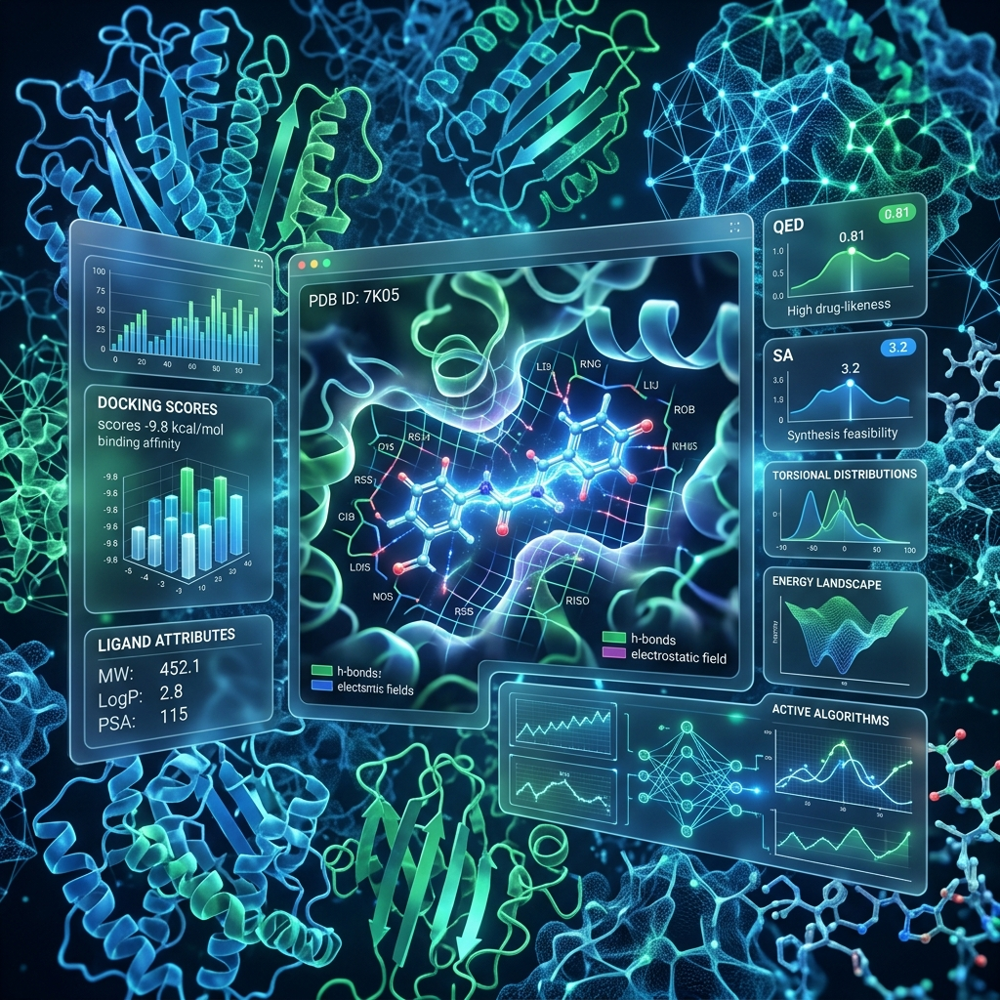
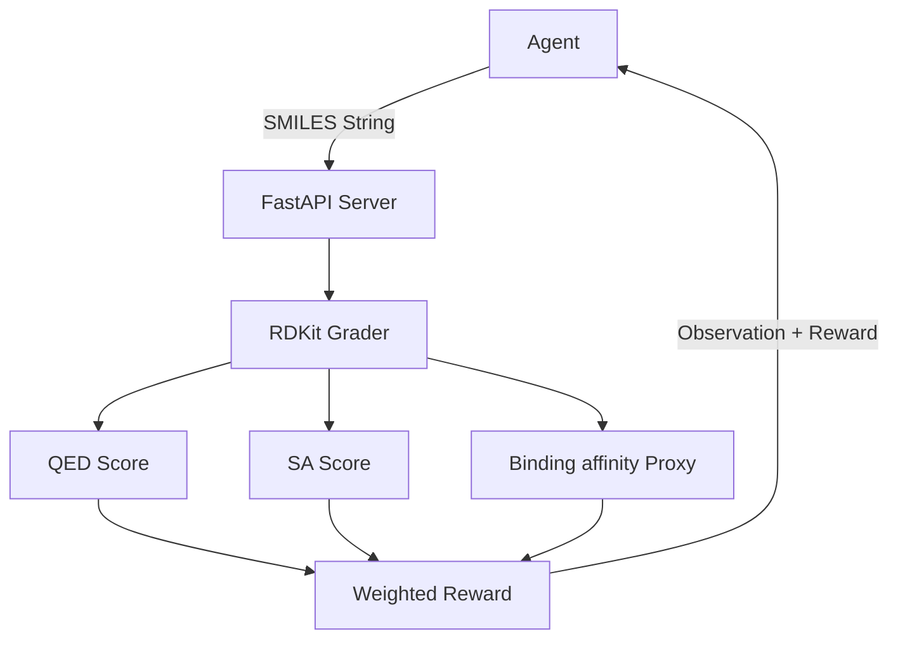

<div align="center">

# 🧬 Drug Discovery OpenEnv
### The "Flight Simulator" for AI Drug Discovery Agents

[](https://opensource.org/licenses/MIT)
[](https://www.python.org/downloads/release/python-3110/)
[](https://fastapi.tiangolo.com/)
[](https://www.rdkit.org/)

**Scaler × Meta × PyTorch Hackathon (Round 1 Submission | April 2026)**

---



*A realistic, scientifically grounded environment where AI agents can learn to navigate the 10^60 possible drug-like molecules without touching a single physical compound.*

</div>

## 🌟 Overview

Drug discovery—the search for a small molecule that fits a disease-causing protein—is a grand challenge in biology. With more possible drug-like molecules ($10^{60}$) than atoms in the observable universe, brute-force search is impossible.

**Drug Discovery OpenEnv** provides the training ground for frontier models to learn intelligent chemical search. It is an **OpenEnv Spec Compliant** environment designed to run on minimal hardware (2 vCPU, 8 GB RAM) while maintaining high scientific fidelity.

### Where we fit in the Pipeline
| Stage | What Happens | Status |
| :--- | :--- | :--- |
| **Protein Sequence** | Identify villain protein from gene sequencing | Biology / Wet Lab |
| **3D Protein Shape** | AlphaFold (DeepMind) predicts 3D shape | ✅ Solved - AlphaFold |
| **Drug Molecule** | **AI agent proposes molecules; OpenEnv scores them** | 📍 **THIS PROJECT** |
| **Clinical Trials** | Real-world testing in labs and humans | Later |

---

## 🔬 Scientific Credibility

We utilize peer-reviewed scoring proxy models grounded in real pharmaceutical science:

- **QED (Quantitative Estimation of Drug-likeness)**: [Bickerton et al., Nature Chemistry (2012)](https://www.nature.com/articles/nchem.1243).
- **SA (Synthetic Accessibility)**: [Ertl & Schuffenhauer, Novartis Research (2009)](https://jcheminf.biomedcentral.com/articles/10.1186/1758-2946-1-8).
- **Binding Proxy**: Morgan fingerprint similarity to **2 million+** known actives from the [ChEMBL database](https://www.ebi.ac.uk/chembl/).

---

## 🏗️ Three Hard Tasks

Each task features a fully deterministic grader and progressive difficulty.

### 🟢 Task 1: Lead Optimization (Easy)
- **Objective**: Optimize a near-perfect molecule (affinity ~200 nM) to < 50 nM without breaking drug-likeness.
- **Target**: **EGFR Kinase** (implicated in various cancers).
- **Limit**: 20 attempts.

### 🟡 Task 2: Scaffold Hopping (Medium)
- **Objective**: Structural redesign of a potent but toxic molecule (PAINS match) to retain potency while clearing toxicity.
- **Target**: **BCL-2 Inhibitor** (implicated in lymphoma).
- **Limit**: 20 attempts.

### 🔴 Task 3: De Novo Design (Hard)
- **Objective**: Design a molecule from scratch given only the protein pocket shape.
- **Target**: **COVID-19 Main Protease (Mpro)**.
- **Limit**: 15 attempts (Maximum challenge).

---

## 🛠️ Architecture & Setup



### 📋 Prerequisites
- Python 3.11
- RDKit (via `pip install rdkit`)

### 🚀 Local Quickstart
1. **Clone & Install**:
   ```bash
   git clone https://github.com/your-team/drug-discovery-openenv
   pip install -r requirements.txt
   ```
2. **Start Server**:
   ```bash
   uvicorn main:app --host 0.0.0.0 --port 7860
   ```
3. **Run Baseline Inference**:
   ```bash
   export MODEL_NAME=gpt-4o-mini
   export OPENAI_API_KEY=your-key
   python inference.py
   ```

---

## 📊 Baseline Scores
*Baseline results using GPT-4o-mini with greedy SMILES sampling.*

| Task | Score | Steps | Status |
| :--- | :--- | :--- | :--- |
| Lead Optimization | ~0.45 | 20 | Partial |
| Scaffold Hopping | ~0.38 | 20 | Partial |
| De Novo Design | ~0.28 | 15 | Partial |

*Success Threshold: 0.85*

---

## ⚡ API Reference

| Endpoint | Method | Description |
| :--- | :--- | :--- |
| `/reset` | `POST` | Resets environment for a specific task. |
| `/step` | `POST` | Submits a SMILES string and returns results. |
| `/state` | `GET` | Retrieves current episode metrics. |
| `/tasks` | `GET` | Lists all available task configurations. |

---

## 🛰️ One-Liner for Judges

> "We built a flight simulator for drug discovery AI—where an agent learns to navigate $10^{60}$ molecules using proxy models grounded in real experimental data, with three objectively graded tasks from lead optimization to de novo design."

---

<div align="center">
Built with ❤️ for the Scaler × Meta × PyTorch Hackathon.
</div>
